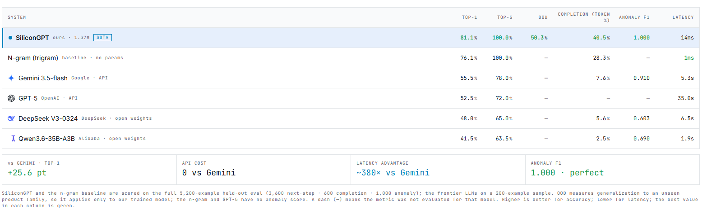
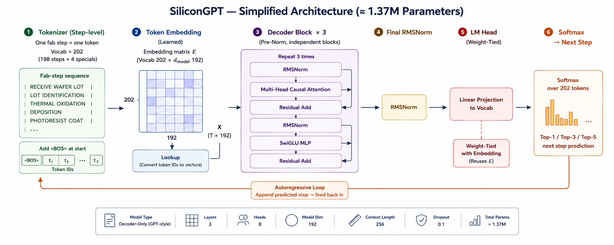
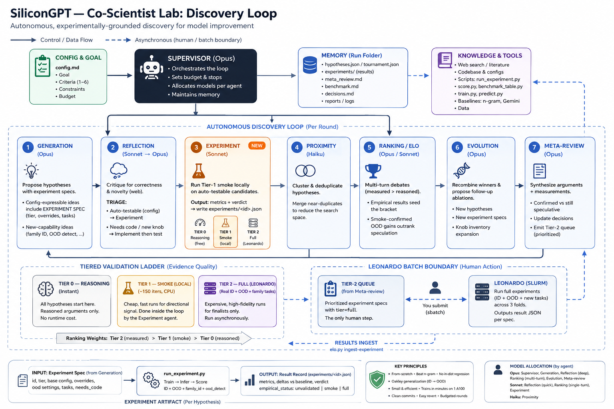

# SiliconGPT — Learning & Benchmarking Process Logic

> A **1.37M-parameter** decoder transformer, trained **from scratch**, that learns the *logic* of
> semiconductor-fab process recipes — and beats frontier LLMs (GPT-5, Gemini, DeepSeek, Qwen) at it
> while being **~1000× smaller**.

## What is this?

Every microchip is manufactured by running a silicon wafer through a long, strictly-ordered sequence
of **process steps** — clean, oxidize, deposit, pattern, etch, implant, anneal, measure, and so on
(~100–150 steps per recipe). The order isn't arbitrary: it follows hard **process logic** (for
example, *"an RCA clean must precede oxide growth"*). Getting a step out of order can ruin a wafer.

**SiliconGPT learns that process logic directly from data.** We treat a recipe like a sentence —
**one process step = one token** — and train a small transformer **from scratch** to model the
"language" of fab recipes. No giant pretrained LLM, no external API: a compact, sovereign,
reproducible model that runs on a CPU.

### What it does — four tasks

1. **Next-step prediction** — given the recipe so far, predict the next process step (ranked top-1/3/5).
2. **Sequence completion** — given the first part of a recipe, generate the rest of it.
3. **Anomaly detection** — given a complete recipe, decide whether it's **valid or rule-violating**, and name the exact rule that's broken.
4. **Out-of-distribution (OOD) generalization** — does it still work on a **product family it has never seen**? This is the real test of whether the model learned transferable *logic* or just memorized patterns.

The three predictive tasks each produce a result file (`nextstep.csv`, `completion.csv`,
`anomaly.csv`); OOD is measured by holding out an entire product family the model never trained on.

**The surprising finding:** a measurement-grounded multi-agent *discovery loop* searched the design
space and found that a **smaller** model (25M → 1.37M) *generalizes better* out-of-distribution — at
**no** in-distribution cost. The result is a tiny, from-scratch model that **beats GPT-5 / Gemini /
DeepSeek / Qwen on every task** while being ~1000× smaller, with **zero API cost**.

> Built at **Zero One Hack_01** (Industrial AI / Infineon track). Full numbers + the discovery
> story: **[`REPORT.md`](REPORT.md)**.

---

## Why this matters

Many industrial processes — and semiconductor fabrication especially — are **long sequences of steps
whose meaning depends entirely on order and process logic**: materials are deposited, patterned,
modified, and removed in a precise, rule-governed order. That structure is highly regular, yet
**hard to model robustly or benchmark** without dedicated training and evaluation.

The deciding question isn't just *"can a model predict the next step?"* — it's **whether a model
truly learns the underlying *process logic* or merely memorizes patterns.** The test is
generalization to **unseen or modified workflows**: a model that *understands* the logic should
transfer to a product family it has never seen; one that *memorizes* won't. That's why **OOD
generalization is the metric that decides everything** here.

And why a **small, from-scratch** model instead of a big-LLM API? Because the goal is **sovereign,
reproducible process intelligence** — owning the data generation, the training, and the evaluation,
and understanding how model size and data strategy affect process understanding — not a black-box
wrapper. A compact model you can run, audit, and deploy yourself is the point.

**Practical payoff:** a model that has learned process logic can **autocomplete recipes**, **catch
invalid or out-of-order steps before they ruin a wafer** (anomaly detection that names the exact rule
violated), and act as a **benchmark of process understanding** across model sizes and data strategies.

---

## Benchmark — head-to-head

A **1.37M** from-scratch decoder vs. an n-gram baseline and four frontier LLMs, on our held-out
eval — **+25.6 pt vs Gemini on Top-1, ~380× lower latency, $0 API cost, and a perfect anomaly F1 (1.000)**.



> Full **5,200-example** held-out eval (3,600 next-step · 600 completion · 1,000 anomaly); the
> frontier LLMs on a 200-example sample. **OOD** = generalization to an unseen product family, so it
> applies only to our trained model. Higher is better for accuracy; lower for latency.

---

## Run it from a clean checkout

Needs **Python 3.12** and a GPU for training (CPU works for the smoke test + inference). The
dataset and checkpoints are **gitignored and regenerable** — the steps below reproduce them.

```bash
# 1. Install (one manifest covers training, inference, and the demo backend)
pip install -r requirements.txt
#    (on the Leonardo cluster we use pixi: bash scripts/setup_leonardo.sh)

# 2. Regenerate the synthetic dataset — deterministic, ~30 s  -> data/
python scripts/build_datasets.py --seed 42

# 3. (optional) smoke-test the whole loop on CPU in seconds
python src/process_logic/train.py --smoke --device cpu

# 4. Train the 1.37M deliverable (3 layers · d=192 · RoPE) on all families — minutes on 1 GPU
python src/process_logic/train.py \
    --config configs/train_v1.yaml --model-config configs/model_3m_rope.yaml \
    --ckpt-dir checkpoints/final_3m_rope --device cuda
#    -> checkpoints/final_3m_rope/best.pt
```

> **The trained deliverable is already committed** at `checkpoints/best.pt` (5.2 MB — the 1.37M
> RoPE model), so you can **skip step 4 and run inference directly**. Step 4 reproduces the
> *byte-identical* checkpoint at `checkpoints/final_3m_rope/best.pt`. (The dataset and the larger
> experiment checkpoints stay gitignored/regenerable.)

---

## Run inference on your own data (CPU — no GPU needed)

Point the model at a CSV of recipes to get predictions for all three tasks, then score them.
Both steps run on a plain **CPU** — no GPU required (the command auto-detects CUDA if present).

**Input format** — the model reads only the input columns; steps are `|`-separated:

| File | Required columns | Used for |
|---|---|---|
| `eval_input_valid.csv`   | `EXAMPLE_ID`, `PARTIAL_SEQUENCE` | next-step **and** completion |
| `eval_input_anomaly.csv` | `EXAMPLE_ID`, `SEQUENCE`         | anomaly |

> Don't have your own CSVs? `python scripts/build_datasets.py` generates ready-to-use
> `data/eval_*.csv` with these exact columns.

**Output format** — `predict.py` writes one CSV per task:
`EXAMPLE_ID,RANK_1..RANK_5` (next-step) · `EXAMPLE_ID,PREDICTED_SEQUENCE` (completion) ·
`EXAMPLE_ID,IS_VALID,SCORE,PREDICTED_RULE` (anomaly).

### Try it in seconds (built-in subset)

Confirm the whole **predict → score** pipeline works on your machine, on a tiny built-in subset —
on a single **CPU**:

**One command (recommended):**

```bash
bash scripts/run_demo.sh
```

It uses the committed checkpoint (`checkpoints/best.pt`), carves a tiny subset
(`data/eval_*_demo.csv` — 6 next-step / 5 completion / 6 anomaly examples) from the full eval
files if it isn't there yet, predicts on it, and scores it. Outputs land in
**`extras/test_folder/`** (`nextstep.csv`, `completion.csv`, `anomaly.csv`, `score_demo.txt`).
The script auto-detects the env: it uses **pixi** if present, otherwise the `python` on your
`PATH` (e.g. after `pip install -r requirements.txt`).

> Needs `data/` to exist — run `python scripts/build_datasets.py` first on a clean checkout
> (the dataset is gitignored/regenerable). The script tells you if a file is missing.

**Manual (the exact two steps the script runs)** — useful if you want to point at your own
files or run inside an explicitly activated environment:

```bash
# activate the env (pick one):
export PATH="$HOME/.pixi/bin:$PATH"      # our env -> prefix the commands below with `pixi run`
# or:  pip install -r requirements.txt   # plain venv -> run `python ...` directly

# 1) predict on the tiny subset, on CPU
pixi run python src/process_logic/predict.py \
    --ckpt checkpoints/best.pt --device cpu --out-dir extras/test_folder \
    --nextstep-input   data/eval_nextstep_demo.csv \
    --completion-input data/eval_completion_demo.csv \
    --anomaly-input    data/eval_anomaly_demo.csv \
    --calib-file       data/val_id.csv

# 2) score (--intersect filters the full ground truth down to the subset's IDs)
pixi run python src/process_logic/score.py \
    --pred-dir extras/test_folder --gt-dir data --intersect
```

Swap `--device cpu` for `--device cuda` and the `*_demo.csv` inputs for the full `eval_*.csv`
(or your own CSVs) to run on the complete dataset.

---

## Live demo (optional UI)

- **Live demo:** https://silicon-oracle-suite.lovable.app/  *(works while the backend tunnel is up)*
- **Frontend source:** https://github.com/Unais2003/silicongpt-intelligence-front  (React · TanStack Start · MIT)

A Flask backend exposes the model; the frontend visualizes it. Both call the **same** model — the
backend is the real engine, the UI is the demo.

```bash
python server/app.py        # serves http://localhost:5050 (defaults to checkpoints/best.pt; override with CHECKPOINT_PATH)
```

- **Single-sequence:** load a held-out validation example → next-step (top-1/3/5) · complete
  (greedy or sampled) · validate (10 rules) · anomaly.
- **Batch:** "Run validation set" (no upload) or drop an `eval_*` CSV → full metrics + per-family.

Frontend + screenshots: see **[`REPORT.md`](REPORT.md)** (Results) and `extras/results/`.

---

## How the model works

SiliconGPT is a small, **decoder-only transformer** (GPT-style, causal), trained from scratch — a
modern stack with **no biases** and the embedding/head **weight-tied**.



```
vocab 202 (198 step tokens + 4 specials) · d_model 192 · 3 layers · 8 heads (head_dim 24)
SwiGLU MLP 192→512→192 (SiLU) · RoPE rotary positions · RMSNorm (pre-norm) · context 256
weight-tied embedding↔head · no biases · ~1.37M parameters
```

- **One process step = one token** (202-token vocab) — the model learns the *grammar* of fab recipes directly, not English.
- **Position via RoPE** (rotary) applied to Q,K in every attention layer — there is no learned position embedding.
- **Weight tying:** the LM head reuses the token-embedding matrix. **No cross-layer weight sharing** — each of the 3 blocks is independent (we tested sharing; it hurt OOD).
- **Anomaly detection is hybrid:** the model's own perplexity **+** a deterministic rule validator (exact rule attribution).

---

## The discovery loop — how we found the architecture

We didn't hand‑tune SiliconGPT. We built a **measurement‑grounded multi‑agent loop** — *inspired by*
Google's AI Co‑Scientist, but implemented as a **deterministic sequential pipeline** (not the paper's
asynchronous agent mesh) — and added a **GPU Experiment agent** that actually trains and benchmarks
every hypothesis, so an Elo tournament ranks ideas on **measured OOD, not argument**.



**One round, in order** (the Supervisor orchestrates; `config.md` holds the goal + criteria):

1. **Generation** — propose hypotheses, informed by last round's meta‑review.
2. **Reflection** — peer‑review + filter, and triage each as *config‑expressible* (auto‑testable) or *needs‑code*.
3. **Experiment** ★new★ — train + benchmark each idea up a 3‑tier ladder (debate → smoke → full 3‑fold OOD on A100) and write a **measured result**.
4. **Proximity** — cluster / de‑duplicate the surviving ideas.
5. **Ranking** — Elo tournament, weighting *measured > simulated > reasoned*.
6. **Evolution** — recombine the winners into new hypotheses.
7. **Meta‑review** — synthesize the round's lessons, fed into every agent next round.

The Supervisor then runs another round or stops (plateau / budget). **How it differs from Google's
Co‑Scientist:** the original is an asynchronous mesh with many concurrent feedback loops; ours is a
**single sequential pass per round** with one feedback edge (Meta‑review → next round), plus the
**Experiment agent** — our key addition, which grounds the tournament in real GPU runs.

Across two rounds it tested **eight levers, rejected five with measured negatives**, and found the
counterintuitive winner — **shrink the model** (25M → 1.37M) for better OOD at no in‑distribution cost.
Full run record: [`extras/results/coscilab/COSCIENTIST_LAB.md`](extras/results/coscilab/COSCIENTIST_LAB.md) · method + negatives: [`REPORT.md`](REPORT.md).

---

## Tests

```bash
python tests/test_vocab.py      # tokenizer (no torch)
python tests/test_dataset.py    # batching  (no torch)
python tests/test_score.py      # metrics   (no torch)
python tests/test_model.py      # model     (needs torch)
python tests/test_generate.py   # inference (needs torch)
```

## Repo layout

```
src/process_logic/   vocab · dataset · model · train · generate · anomaly · predict · score
                     generation (vendored official grammar + validate_sequence)
scripts/             build_datasets.py · run_*.sh (Leonardo Slurm) · benchmark_*.py
server/              Flask inference API (app.py, inference.py)
configs/             model_3m_rope.yaml (deliverable) · model_v1.yaml (25M) · train_v1.yaml
data/                generated (gitignored) — regenerate with build_datasets.py
extras/results/      prediction CSVs + benchmark outputs + the discovery run record
eval/                (optional) external scorer drop-in
```

See **[`REPORT.md`](REPORT.md)** for the full technical write-up and the discovery story.

> **Honesty note:** the final 1.37M checkpoint **is committed** (`checkpoints/best.pt`, 5.2 MB) so
> anyone can run inference without retraining; the dataset and the larger experiment checkpoints
> (25M V1, OOD runs) are *not* committed (gitignored) — they regenerate deterministically with the
> commands above. The model trains **from scratch** and uses **no external API at inference**. The
> OOD gain is modest but real (+0.008 next-step Top-1, 3-seed mean) — the bigger wins are efficiency
> (~18× smaller than our 25M baseline) and the rigorous, measured discovery process. Block-level
> Accuracy shown in the UI is our 5-step-window interpretation.
