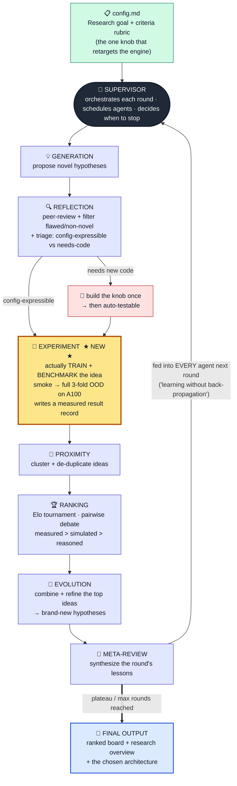
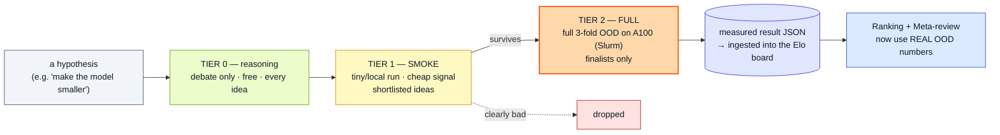

# Co-Scientist Lab — Multi-Agent Discovery Architecture

*Presentation documentation. The diagrams below are Mermaid (paste into Lovable / any Mermaid renderer to
draw); an ASCII version is included as a fallback. All result numbers are verified from the run's
experiment JSONs.*

---

## 1. What it is — in one line

A **measurement-grounded adaptation of Google's AI Co-Scientist**: a team of specialized LLM agents that
**generate → debate → tournament-rank → evolve → synthesize** hypotheses for an open-ended research goal —
extended with a **new Experiment agent** that actually **trains and benchmarks** each promising idea on GPU,
so the tournament ranks ideas on **real measured results, not just argument.**

> One sentence for the slide: *"Co-Scientist proposes; the benchmark disposes."*

---

## 2. The architecture diagram (Mermaid)



### The Experiment agent's tiered validation ladder (the new part)



> Because GPU is the binding constraint, ideas earn their way up the ladder: everything is debated (free),
> only shortlisted ideas get a cheap smoke run, and only finalists consume a full A100 run. Tier-2 results
> flow back so the tournament re-ranks on measured truth.

---

## 3. ASCII fallback (if a tool can't render Mermaid)

```
                 ┌─────────────────────────────────────────┐
                 │  config.md : research goal + criteria    │
                 └───────────────────┬─────────────────────┘
                                     v
                         ╔═══════════════════════╗
        ┌───────────────▶║       SUPERVISOR      ║◀───────────────┐
        │                ║  (orchestrates round) ║                │
        │                ╚═══════════╤═══════════╝                │
        │                            v                            │
        │                  ┌────────────────────┐                 │
        │                  │     GENERATION     │  ideate         │
        │                  └─────────┬──────────┘                 │
        │                            v                            │
        │                  ┌────────────────────┐                 │
        │                  │     REFLECTION     │  review + triage │
        │                  └───┬────────────┬───┘                 │
        │        config-expr.  │            │  needs-code          │
        │                      v            v                     │
        │             ┌──────────────┐  ┌──────────┐              │
        │             │  EXPERIMENT  │◀─│ build knob│              │
        │             │   ★ NEW ★    │  └──────────┘              │
        │             │ train+bench  │  smoke → full OOD (A100)    │
        │             └──────┬───────┘                            │
        │                    v                                    │
        │            ┌────────────────┐                           │
        │            │   PROXIMITY    │  cluster / dedupe          │
        │            └───────┬────────┘                           │
        │                    v                                    │
        │            ┌────────────────┐                           │
        │            │    RANKING     │  Elo tournament            │
        │            │ measured>reason│  (pairwise debate)         │
        │            └───────┬────────┘                           │
        │                    v                                    │
        │            ┌────────────────┐                           │
        │            │   EVOLUTION    │  combine/refine → new      │
        │            └───────┬────────┘                           │
        │                    v                                    │
        │            ┌────────────────┐   feedback to all agents  │
        └────────────│  META-REVIEW   │───────────────────────────┘
                     └───────┬────────┘
                             v  (plateau / max rounds)
                ┌────────────────────────────┐
                │  FINAL: ranked board +      │
                │  research overview +        │
                │  chosen architecture        │
                └────────────────────────────┘
```

---

## 4. What each agent does (one line each)

| Agent | Role |
|---|---|
| 🧭 **Supervisor** | The main controller. Runs each round, assigns the other agents, and decides when to stop (plateau or max rounds). |
| 💡 **Generation** | Ideates — proposes novel, testable hypotheses for the goal, grounded in the literature + prior lessons. |
| 🔍 **Reflection** | The peer reviewer. Critiques each idea, discards flawed/non-novel ones, and **triages** whether an idea is *config-expressible* (auto-testable) or *needs new code*. |
| 🧪 **Experiment ★NEW★** | Our addition. Turns a config-expressible hypothesis into an experiment, **actually trains + benchmarks** it (smoke → full 3-fold OOD on the A100), and writes the **measured result** back so ranking is empirical. |
| 🧲 **Proximity** | Clusters and de-duplicates hypotheses so the tournament pairs similar ideas and we don't re-test the same thing twice. |
| 🏆 **Ranking** | Runs the **Elo tournament** — pairwise *debates* between hypotheses — weighting **measured > simulated > reasoned** evidence, producing a ranked board. |
| 🧬 **Evolution** | Takes the top-ranked ideas and **combines / refines** them into brand-new hypotheses (which must re-win the tournament). |
| 📝 **Meta-review** | Synthesizes the round's lessons into a critique that is **fed into every agent next round** — the system's "learning without back-propagation." Writes the final research overview. |

---

## 5. How one round flows

1. **Generate** new hypotheses (informed by last round's meta-review).
2. **Reflect** — review, filter, and triage each into *auto-testable* or *needs-code*.
3. **Experiment** — train + benchmark the auto-testable ones up the tier ladder (smoke → full OOD), writing measured results.
4. **Proximity** — cluster/dedupe the surviving ideas.
5. **Rank** — Elo tournament; a *measured* OOD win beats a clever argument.
6. **Evolve** — recombine the winners into new hypotheses.
7. **Meta-review** — synthesize what was learned; feed it back to every agent.
8. **Supervisor** decides: another round, or stop (plateau / budget) → write the final overview.

---

## 6. What we actually ran & found

**Goal given to the lab:** *discover the architecture / data / training changes that make our small,
from-scratch process-sequence model generalize to an unseen 4th semiconductor family (out-of-distribution,
the deciding metric), without overfitting and without regressing in-distribution.*

**Baseline (V1):** 25M-parameter from-scratch transformer · in-distribution next-step **top-1 0.807** (saturated;
a trigram nearly ties it) · **3-fold OOD next-step top-1 0.4947** (a large gap — the open problem).

### Round 1 — method online + first discovery
| lever tested (full 3-fold OOD) | OOD top-1 | Δ vs baseline | verdict |
|---|---|---|---|
| control (25M) | 0.4947 | — | baseline |
| cross-family data augmentation | 0.4767 | **−0.018** | ❌ rejected |
| NoPE (no positional encoding) | 0.4983 | +0.004 | ➖ neutral |
| **scale DOWN to ~6M** | **0.5119** | **+0.017** | ✅ **improves OOD** |

→ **Discovery:** shrinking the model *improved* OOD at **zero in-distribution cost.** Re-baselined the search at the small size.

### Round 2 — scaling curve + error decomposition
| lever | OOD top-1 | Δ | verdict |
|---|---|---|---|
| scale 1.4M (3L/128) | 0.5139 | +0.019 | ⚠️ best OOD but **regresses in-dist** |
| **scale ~3M (3L/192)** | **0.5120** | **+0.017** | ✅ **best all-around** (in-dist also up) |
| scale 6M (4L/256) | 0.5119 | +0.017 | ✅ best OOD completion |
| scale 15M (6L/384) | 0.5008 | +0.006 | ➖ gain mostly gone |
| weight-sharing (at 3M) | 0.5033 | −0.009 | ❌ rejected |
| NoPE + augmentation | 0.4861 | −0.009 | ❌ rejected |
| constrained decoding *(diagnostic)* | — | — | ❌ rejected: only **~3%** of OOD errors are grammar-invalid |

### The five principled negatives (each rules out a tempting direction)
1. **Description-init embeddings** — −0.018
2. **Cross-family data augmentation** — −0.018
3. **NoPE + augmentation** — −0.009 (NoPE alone: neutral)
4. **Constrained decoding** — ~97% of OOD errors are *valid-but-wrong* (only ~3% recoverable)
5. **Weight-sharing** — −0.009 (structural capacity-cut ≠ size capacity-cut)

### The scientific conclusion the loop reached
> Levers touching **data, embeddings, positional encoding, decoding, and weight-tying all fail.**
> **Only reducing total parameters helps.** The remaining OOD gap is a **hard transition-structure
> residual**: on an unseen family the model reliably emits a *legal* step — just the *wrong* legal one.
> Mechanism: a saturated in-distribution task means a 25M model spends its excess capacity memorizing
> **non-transferable per-family shortcuts**; a smaller model can't afford them, so it learns transferable structure.

---

## 7. The final architectural decision

| | V1 (before) | **Final (after)** |
|---|---|---|
| Size | 25M (8 layers, 512 dim) | **~3M (3 layers, 192 dim)** — 6–8× smaller |
| Positional encoding | RoPE | RoPE (NoPE neutral) |
| Data augmentation | — | **none** (rejected) |
| Embedding init | learned | learned (desc-init rejected) |
| Weight-sharing | no | **no** (rejected) |
| Anomaly | hybrid (validator + perplexity) | hybrid — unchanged (ROC-AUC ~1.0) |
| **3-fold OOD next-step top-1** | 0.4947 | **0.512 (+0.017)** |
| In-distribution top-1 | 0.807 | **~0.81 (no regression)** |

**Final model = "V1, made small and clean," trained on all families.** Smaller, faster, cheaper to
deploy, *and* better on the deciding out-of-distribution metric — at no in-distribution cost.

---

## 8. Why the method matters (the slide takeaway)

- **Multi-agent orchestration** turned an open architecture-search question into a **debated, tournament-ranked, empirically-validated** process — not trial-and-error.
- The **new Experiment agent** is the key upgrade over the original Co-Scientist: ideas are **measured on real GPU runs**, so the tournament ranks on **truth**, not eloquence.
- It produced **one reproducible win + five principled negatives + a sharp diagnosis** — honest, measured science, exactly what the challenge rewards over "LLM wrappers."
- The **criteria rubric is the only thing that changes** to point this engine at any new problem — the machinery (generate → reflect → experiment → rank → evolve → meta-review) stays fixed.
